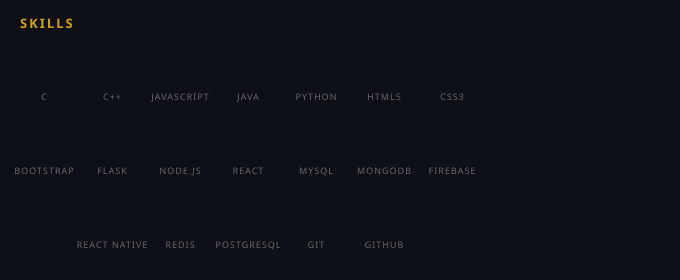

# 💫 About Me:
I am a Computer Engineering student with a strong interest in software development and problem solving. I enjoy learning new technologies and improving my skills step by step through practice and real-world examples.

I am currently focused on strengthening my programming fundamentals and building real-world projects to gain hands-on experience.

I am open to collaborating on beginner-friendly projects, open-source contributions, and development work where I can grow while contributing meaningfully.

I am actively improving my Data Structures and Algorithms, logical thinking, and understanding of how to apply concepts in real-world systems.

I am currently learning Data Structures and Algorithms, Java, Python, and core computer engineering concepts related to software development.

Fun fact: I believe consistency and small daily improvements matter more than speed, and I enjoy learning at my own pace.

---

## 🌐 Socials:

---

# 💻 Tech Stack:

---

